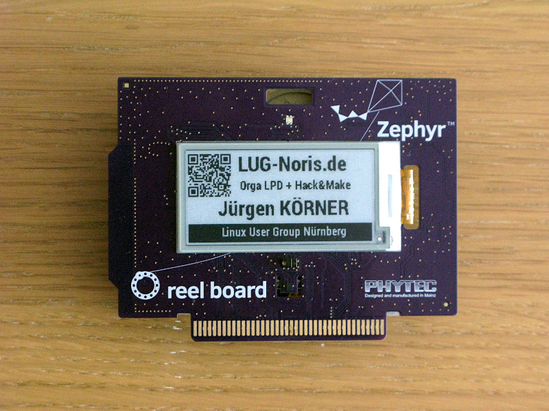
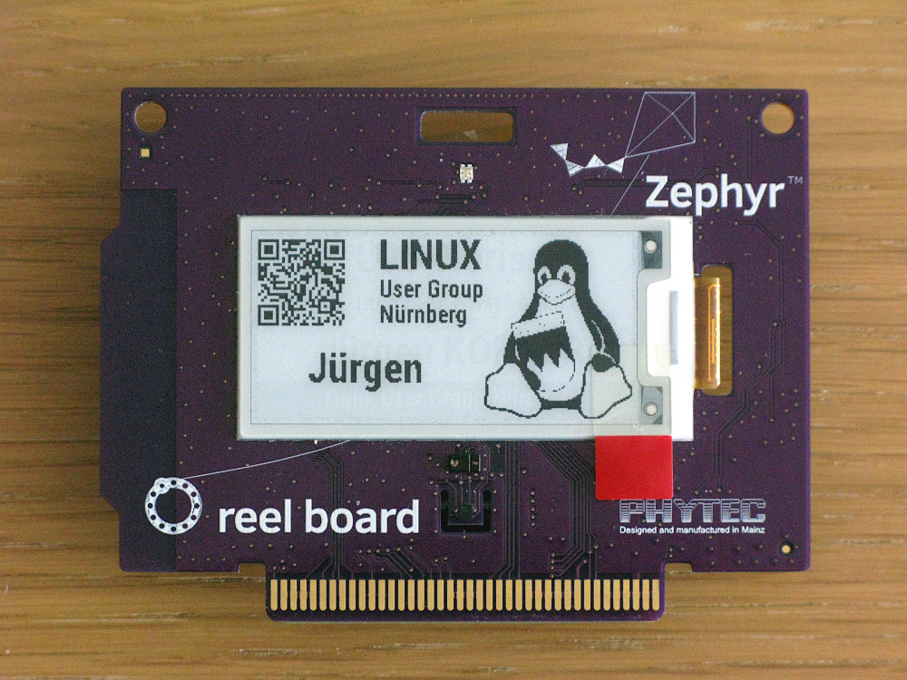

# phytec-reel-board-vcd-mesh-badge-de

Maindisplay on an reel board with LVGL support. Tested for "reelboard hardware 1507.1" and Zephyr-sdk-0.10.3. 

This demo combined a LVGL demo with the mesh-badge demo, both from PHYTEC Messtechnik GmbH www.phytec.de

For more information please read README.rst (german/english)

This is a contribute of the Linux User Group Nuremberg www.lug-noris.de

Add. Info: MIT licence for modules qrcodegen.c and qrcodegen.h 

New version release 12.2021 with smartphone-support via nRF-Connect-App, activ beeper with hardware revision 1507.3 and 
a new plain with qr-code and our tux logo.

The Zephyr OS build v2.1.0-rc1 and the Zephyr-sdk-0.10.3 was used for compiling.
